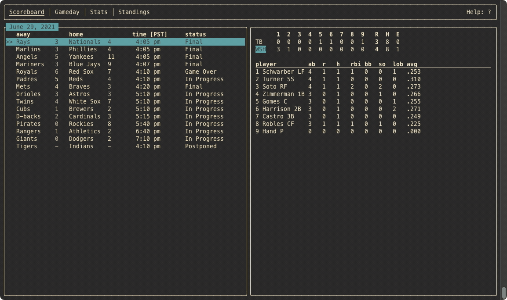

# mlbt

[](https://github.com/andschneider/mlbt/actions/workflows/ci.yml)
[](https://deps.rs/repo/github/mlb-rs/mlbt)

A terminal user interface for the MLB Statcast API, written in Rust.

Check scores, standings, and stats. Even watch a live game using Gameday!



## Table of Contents

- [What](#what)
- [Installation](#installation)
    - [Homebrew](#homebrew)
    - [Binaries](#binaries)
    - [Cargo](#cargo)
- [Features](#features)
- [Usage](#usage)
    - [Scoreboard](#scoreboard)
    - [Gameday](#gameday)
    - [Stats](#stats)
    - [Standings](#standings)
    - [Date Picker](#date-picker)
    - [Help](#help)
- [Config](#config)
- [Shout out](#shout-out)
- [Copyright Notice](#copyright-notice)
- [License](#license)

## What

The MLB Statcast API is a publicly available (see its [license](#license)
information below) REST API that you can query to get back almost any
information about a baseball game, past or present. If you've ever watched a
baseball game on TV you've seen the data the API passes around in action. Two
prime examples are the pitch/strike zone overlay, and home run stats (like
distance and launch angle). This is accomplished by MLB's sophisticated Statcast
vision system, which is implemented in every Major League ballpark.

This TUI is an interface for the API, with the intention of providing a light
weight way to consume baseball data. See the [features](#features) listed below
for more details.

A TUI and baseball data make a pretty natural combination, at least compared to
other sports. The Gameday view allows you to "watch" a live game by polling the
API every 10 seconds. This matches the poll rate at which the official Gameday,
found [here](https://www.mlb.com/scores), operates at. The goal with the TUI
version is to mimic the official version as closely as possible.

## Installation

### Homebrew

```bash
brew tap mlb-rs/mlbt
brew install mlbt
```

To update to the latest version:

```bash
brew upgrade mlbt
```

### Binaries

macOS, Linux, and Windows binaries are available on the
[releases](https://github.com/mlb-rs/mlbt/releases) page.

### Cargo

After cloning or downloading the source:

```bash
cargo install mlbt --path .
```

### Docker

Build image with:

```bash
docker build -t mlbt .
```

Execute `mlbt` within the container with:

```bash
docker run -it --rm --name mlbt mlbt:latest
```

## Features

- [X] scoreboard and box score
    - [X] selectable date

- [X] gameday

- [X] standings
    - [ ] team information

- [X] stats
    - [X] player stats
    - [X] team stats
    - [ ] stat search (store in sqlite or an embedded db?)

- [ ] CLI

- [ ] configuration:
    - [X] favorite team
    - [X] time zone
    - [ ] colors
    - [ ] keymap

## Usage

After installing, run `mlbt` from you terminal to open the program.

Press `q` to exit the program at any time.

### Tabs

There are four main tabs.

- Scoreboard
- Gameday
- Stats
- Standings

Press `f` for full screen mode to hide the tab bar.

### Scoreboard

Press `1` to activate this tab.

- `j`: move down
- `k`: move up
- `:`: activate date picker (see [Date Picker](#date-picker))

To switch the team displayed in the box score:

- `h`: home team
- `a`: away team

### Gameday

Press `2` to activate this tab.

By default, the `info` and `pitches` panes are shown. However, each pane can be
toggled on and off using:

- `i`: info pane
- `p`: pitches pane
- `b`: box score pane

To switch the team displayed in the box score:

- `h`: home team
- `a`: away team

### Stats

Press `3` to activate this tab.

You can switch between `pitching` and `hitting` stats and filter based on `team`
or `player` using:

- `p`: pitching
- `h`: hitting
- `t`: team
- `l`: player

Within each stat group (pitching or hitting) you can toggle the display of
individual stat columns by selecting the stat with `Enter`. This selection pane
can be turned on/off with `o`.

To sort the stats by a column, instead of hitting `Enter` you can press `s`. To
flip the sort order from ascending to descending or vice versa press `s` again.

- `j`: move down
- `k`: move up
- `Enter`: toggle stat column
- `s`: sort by the currently selected column
- `:`: activate date picker (see [Date Picker](#date-picker))
- `o`: toggle stat selection pane

> If your terminal is too small to display all columns, they will be turned off
> starting from the left side.

### Standings

Press `4` to activate this tab.

- `j`: move down
- `k`: move up
- `:`: activate date picker (see [Date Picker](#date-picker))
- `Enter`: display a teams roster (TODO)

### Date Picker

With the date picker active, input a date in the form of `YYYY-MM-DD`, or use
the `left`/`right` arrow keys, and press `Enter`. To cancel, press `Esc`. To go
back to the current day, enter `today`.

> Note that each tab has its own date, i.e. if you're viewing older stats or 
> standings, the schedule can be the current date.

### Help

- `?`: display help box
- `Esc`: close help box

> If your terminal is too small to display the full help box, the border will be
> displayed red.

## Config

You can configure the TUI with the toml file located at your users' home
directory. For a user named `Alice` this would be:

- Linux:   `/home/alice/.config/mlbt/mlbt.toml`
- Windows: `C:\Users\Alice\AppData\Roaming\mlbt\mlbt.toml`
- macOS:   `/Users/Alice/Library/Application Support/mlbt/mlbt.toml`

> You can see the path for your user in the `Help` page.

### Available settings

- `favorite_team`: This will make that team always show up first in the schedule
  if they have a game that day.
  See [here](https://github.com/mlb-rs/mlbt/blob/main/src/components/constants.rs#L21)
  for options (note: use the full name and not the short name).
- `timezone`: This will change the time zone of the start time for the games in
  the schedule. The default is `US/Pacific`. Some common options are:
    * `US/Pacific`
    * `US/Mountain`
    * `US/Central`
    * `US/Eastern`
    * For the full list
      see [here](https://en.wikipedia.org/wiki/List_of_tz_database_time_zones)

### Example config

```toml
# See https://github.com/mlb-rs/mlbt#config for options
favorite_team = "Chicago Cubs"
timezone = "US/Pacific"
```

## Shout out

This was originally built with the
wonderful [tui-rs](https://github.com/fdehau/tui-rs). It is now using the also
wonderful fork, [ratatui](https://github.com/ratatui/ratatui).

These TUIs were extremely helpful:
[spotify-tui](https://github.com/Rigellute/spotify-tui),
[tickrs](https://github.com/tarkah/tickrs),
[bottom](https://github.com/ClementTsang/bottom).

A reference MLB stats API client by
[toddrob99](https://github.com/toddrob99/MLB-StatsAPI) helped make up for the
lack of API documentation.

## Copyright Notice

The data used in this application is supplied by the MLB's Stats API. Use of
this data is subject to the license posted here:
http://gdx.mlb.com/components/copyright.txt.

This application and its author are not affiliated with the MLB.

## License

This project is under the
[MIT License](https://github.com/mlb-rs/mlbt/blob/main/LICENSE).
